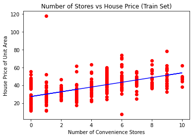
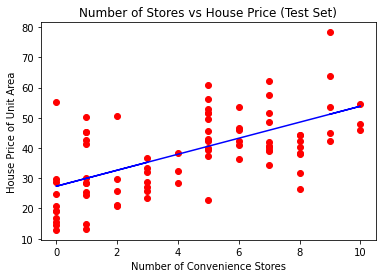

# Real Estate Price Prediction using Linear Regression


## a. Problem Description
- To predict the prices of the House (Estate) using the Number of Convenience Stores available in those areas using Simple Linear Regression
- The dataset used for building the model is a Comma Separated Value(.csv) file that contains 414 records.
- The <b> Number of Convenience Stores , House Price of Unit Areas </b> are the two columns that we are using to build a model upon. 
- [View the Dataset - Real estate.csv]( 
https://github.com/yogeshcenation/Real-Estate-Price-Prediction/blob/a8abc8e9ad7305ded35c3e343430d2b0b1c6a482/Real%20estate.csv
)
***
### 1) Understanding Linear Regression 
It tries to find out the best possible linear relationship between the input features and the target variable (y).

That’s it! This is what Linear Regression does. Pretty simple right?😃

In machine learning jargon the above can be stated as “<b> It is a supervised machine learning algorithm that best fits the data which has the target variable(dependent variable) as a linear combination of the input features(independent variables) ”</b>

```
NOTE:

1. The target variable is also known as an independent variable or label.
2. Input features are also known as dependent variables.
```

### 2) Visualizing the Training Set


### 3) Visualizing the Test Set


### 4) For Viewing the Source Code 
Press [Here](https://github.com/yogeshcenation/Real-Estate-Price-Prediction/blob/a8abc8e9ad7305ded35c3e343430d2b0b1c6a482/Real%20Estate%20Price%20Prediction.ipynb) to view the complete code 

### 5) Built Using
1) <b>IDE</b> -  <b>PyCharm 2021.3.3 (Professional Edition) </b> from JetBrains
2) <b>Base Interpreter</b> - <b>Python 3.10 </b> with Jupyter Kernel
***
## b. Libraries Dependencies 
* numpy -  for working with numerical arrays 
* pandas -  for working with the dataset
* sklearn - used for various operations to get the desired  task
* matplotlib -  used for working with graphs

Python 2 and 3 both work for this.

```
NOTE:
1. Install these libraries before you start to work with your own projects.
2. Visit https://pip.pypa.io/en/stable/ to install any dependencies.
```
***
## c. Other things this repository comes with 
- **Important:** [Getting Help](getting-help.md)
- [Contact Me](contact-me.md)

### 1) How can I thank you for writing and sharing this project?

You can star this project. Starring is free for you, but it tells me
and other people that you like this project.

Go [here](https://github.com/yogeshcenation/Real-Estate-Price-Prediction
) if you aren't here
already and click the "Star" button in the top right corner. You will be
asked to create a GitHub account if you don't already have one.
***
## d. Credits 
I'm  [Yogesh S](https://github.com/yogeshcenation).  and I have codded the project, but other people have helped me with it.

<b> If you like my work, then :</b>

<a href="https://www.buymeacoffee.com/yogeshcenation" target="_blank"></a>
***
If you have trouble with this project please [tell me about
it,](./contact-me.md) and I'll make this project better. If you
like this project, please [give it a
star](./README.md#1-how-can-i-thank-you-for-writing-and-sharing-this-project).
